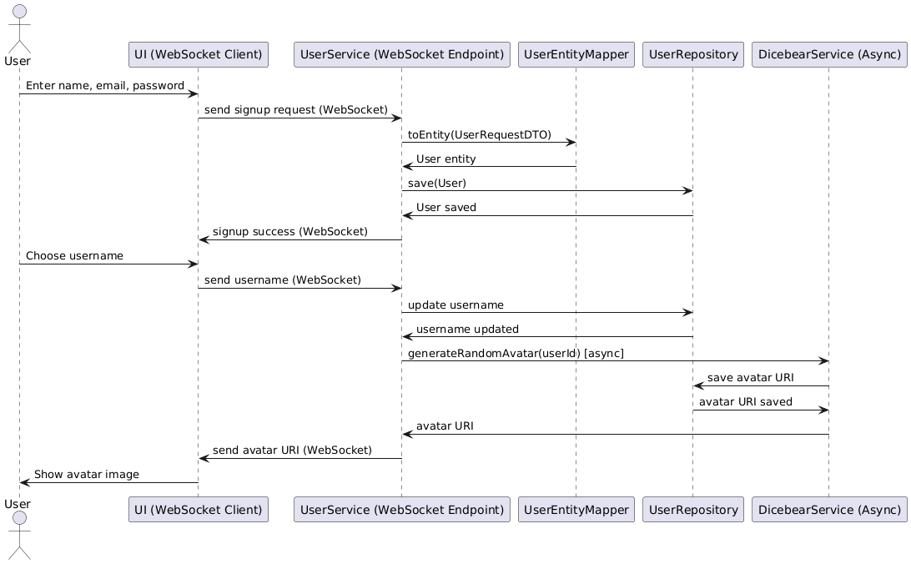

# huddl-user Module

Welcome to the **huddl-user** module! 👤

This is the heart of user management for the Huddl platform. Here, we handle everything from user registration and authentication to profile management and status updates. If it’s about users, it happens here!

## Features
- User registration & login
- Profile management
- User status tracking
- Avatar generation (with DiceBear integration)

## How It Works
Check out the sequence diagram below to see how a typical user registration flow works:

## Tech Stack
- **Java 17**
- **Spring Boot**
- **Maven**

## Getting Started
1. Make sure you have Java 17+ and Maven installed
2. Run `./mvnw spring-boot:run` to start the service
3. Explore the REST APIs for user operations

## Contributing
We love contributions! Feel free to open issues, submit PRs, or suggest new features.

---

*Part of the Huddl platform. Let’s build something awesome together!* 🚀
